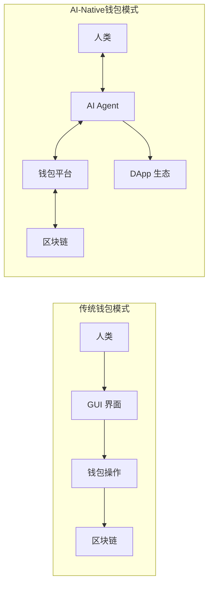
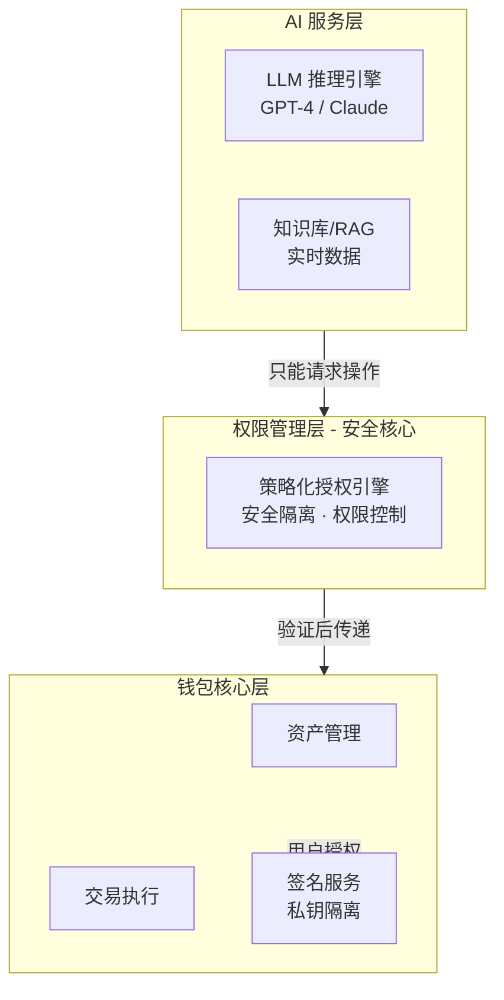
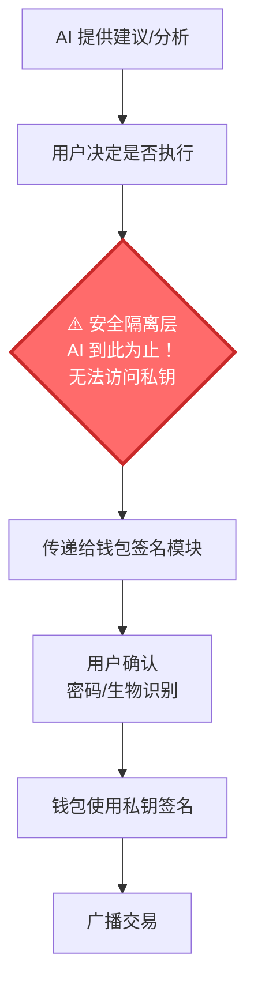
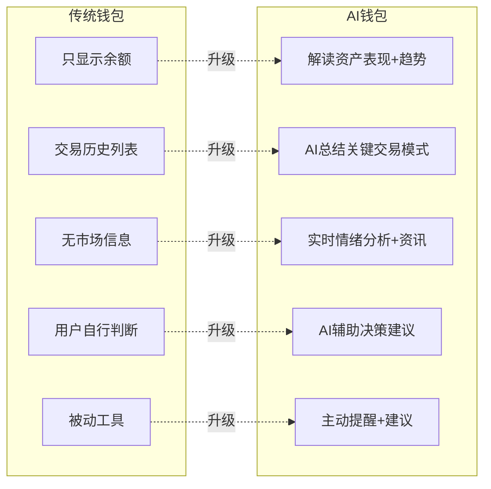
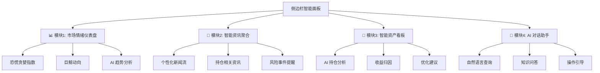
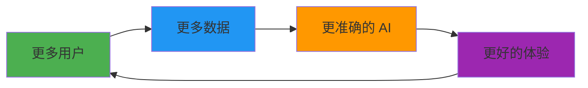
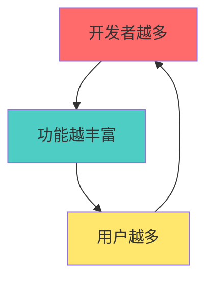
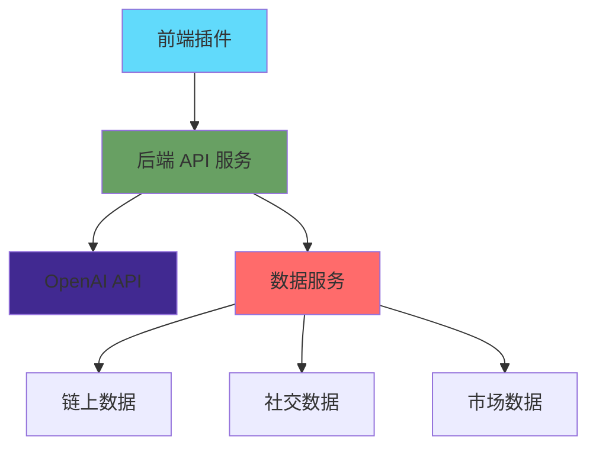

# CatWallet 前端插件方向尝试报告

**撰写日期：** 2026年2月9日  
**截止时间：** 2026年2月11日 12:00  
**报告目标：** 逻辑自洽，有思考模型过滤的前端插件方向探索

---

> 📝 **撰写进度跟踪**
> - ✅ 第二章：市场与竞品分析（已完成）
> - ⏳ 第三章：方向一 - AI-Native 钱包（进行中）
> - ⏸️ 第四章：方向二 - 垂直细分市场
> - ⏸️ 第一章：执行摘要（最后撰写）

---

## 一、执行摘要

> 📌 本章将在完成所有分析后最后撰写

---

## 二、市场与竞品分析

### 2.1 当前钱包市场现状

**市场格局**：MetaMask 占据主导地位（3000万+ 月活），呈现"一超多强"格局。新钱包通过差异化获得细分市场：
- **Rabby**：多链自动切换、交易模拟（专业用户）
- **Rainbow**：NFT 展示、社交化（移动端用户）
- **Phantom**：深度绑定 Solana 生态

**MetaMask 的核心痛点**（为新钱包创造机会）：
- ❌ **信息不对称**：无风险提示、无法识别钓鱼合约
- ❌ **缺乏智能辅助**：完全依赖用户判断，无决策支持
- ❌ **功能单一**：仅基础转账/签名，无高级分析
- ❌ **用户体验**：多链切换繁琐、Gas 费不透明

**关键洞察**：现有钱包的共同盲区是 **AI 智能化辅助**，这正是 CatWallet 的机会。

---

### 2.2 AI + Web3 融合趋势

**AI Agent 技术现状**：LangChain、OpenAI Assistants、AutoGPT 等框架已成熟，支持函数调用、RAG、多模态能力。但 **Web3 领域应用仍处于早期**。

**先行者评估**：
- **Fetch.ai**：去中心化 Agent 网络，技术完整但落地应用有限
- **Morpheus**：链上 AI 推理，概念前沿但产品早期
- **Autonolas**：Agent 服务框架，面向开发者非终端用户
- **传统钱包**：MetaMask、Coinbase Wallet 等暂无 AI 功能

**关键判断**：
- ✅ AI 框架已成熟，可直接调用 OpenAI/Anthropic API
- ❌ 缺乏好用的 AI 钱包产品
- ❌ 没有统一的钱包-Agent 交互标准
- 🎯 **现在是进入的最佳时机**（6-12个月窗口期）

**CatWallet 的独特优势**：
- AI Agent 研发背景（技术优势）
- 钱包开发能力（产品优势）
- 先行者窗口期（时机优势）

---

### 2.3 市场定位与机会

**CatWallet 的独特生态位**：
```
传统钱包（工具） + AI Agent（大脑） = AI-Native 钱包（智能平台）
```

**目标用户**：
- Web3 小白：AI 降低门槛（手把手教学、风险提示）
- DeFi 玩家：AI 增强能力（7x24 监控、策略自动化）
- AI 开发者：提供标准化 Agent API
- 未来：AI Agent 访问 Web3 的基础设施

**竞争态势**：
- 差异化空间大（AI 方向几乎空白）
- 时间窗口开放（6-12个月关键期）
- 技术栈成熟（可直接调用 LLM API）

---

**第二章总结**：MetaMask 垄断但存在痛点，AI+Web3 融合是大势但尚未落地，CatWallet 凭借 AI Agent 背景有先行者优势。**接下来详述 AI-Native 钱包的具体方向**。

---

## 三、方向一：AI-Native 钱包 - 打造面向 AI Agent 的 MetaMask

### 3.1 核心理念与愿景

#### 3.1.1 总目标定位

**打造首个真正为 AI Agent 设计的浏览器钱包插件**

这不是简单地在现有钱包上"加个 AI 功能"，而是从底层架构开始，重新思考钱包在 AI 时代应该是什么样子。

**本质转变：从"工具"到"平台"**



传统钱包是**被动的工具**：
- 等待用户点击按钮
- 显示静态信息
- 逐笔确认交易
- 人类是唯一的操作者

AI-Native 钱包是**主动的平台**：
- 主动提供建议和预警
- 实时分析和学习
- 策略化批量执行
- 同时服务人类和 AI Agent

#### 3.1.2 核心价值主张

**对普通用户：降低 Web3 门槛**

场景示例：
> 小白用户想参与 DeFi 挖矿，传统流程：
> 1. 研究各个协议的 APY（不知道去哪看）
> 2. 学习如何添加流动性（看不懂教程）
> 3. 计算无常损失风险（不会算）
> 4. 手动执行多步操作（容易出错）
> 
> **AI-Native 钱包**：
> 用户："帮我找收益高且安全的挖矿机会"
> AI："建议在 Aave 存入 USDC，当前年化 8%，风险评级 A，是否执行？"
> 用户："好的"
> AI：自动完成授权、存款、领取奖励等全流程

**对专业用户：提升效率**

场景示例：
> DeFi 玩家想做跨协议收益优化，传统流程：
> - 手动监控多个协议的收益率
> - 计算 Gas 费后的净收益
> - 逐个执行提现、兑换、存入操作
> - 错过最佳时机或因 Gas 费高昂放弃
> 
> **AI-Native 钱包**：
> 设定策略："当收益差 > 2% 且 Gas < 20 Gwei 时，自动优化"
> AI：7x24 监控，满足条件自动执行，完成后通知用户

**对 AI 开发者：提供基础设施**

当前痛点：
- AI Agent 想执行链上操作，只能通过 MetaMask 的人类界面（不友好）
- 或者直接管理私钥（极其危险）

**AI-Native 钱包方案**：
```javascript
// 开发者调用 CatWallet Agent API
const result = await catWallet.agent.swap({
  from: 'USDT',
  to: 'ETH', 
  amount: 100,
  policy: 'user_conservative_policy', // 用户预设策略
  maxSlippage: 0.01
});
// 在策略范围内自动执行，无需弹窗
```

**对未来：成为 Agent 访问 Web3 的标准入口**

愿景：
- Web2 时代，浏览器是人类访问互联网的入口
- Web3 时代，钱包是人类访问区块链的入口
- **AI 时代，AI-Native 钱包是 AI Agent 访问 Web3 的入口**

---

### 3.2 技术架构设想

> ⚠️ **安全性第一原则**
> 
> **AI 绝不接触私钥** - 这是整个系统的铁律：
> - ❌ AI 无法访问助记词/私钥
> - ❌ AI 无法直接签署交易
> - ❌ AI 无法绕过用户授权
> - ✅ AI 只能在策略范围内**请求**操作，最终签名仍由用户钱包完成
> - ✅ 所有敏感操作都需要用户明确授权（生物识别/密码）
> 
> **架构设计核心思想**：AI 是"大脑"（决策），钱包是"手"（执行），两者物理隔离

#### 3.2.1 整体架构图

**三层架构设计**（支撑 3.3 中的功能实现）：



**核心原则**：AI 层与私钥物理隔离，所有敏感操作需经过权限管理层验证

#### 3.2.2 数据获取与分析能力

为支撑 3.3 中的功能（市场情绪分析、资讯聚合、巨鲸监控等），需要构建：

**数据源集成**
- 链上数据：区块浏览器 API、RPC 节点、Dune Analytics
- 市场数据：CoinGecko、CoinMarketCap、交易所 API
- 新闻资讯：Twitter API、Crypto 新闻聚合源、社区论坛
- DApp 数据：DeFi Llama、NFT 平台 API

**AI 分析能力**
- LLM 推理：GPT-4 / Claude 用于自然语言理解和内容生成
- 情感分析：社交媒体情绪分析、市场恐慌贪婪指数计算
- 数据可视化：实时图表生成、趋势预测展示

#### 3.2.3 安全架构设计（支撑 DApp 助手等功能的安全基础）

**核心安全原则**：AI **绝不**接触私钥

**安全执行流程**：



**关键设计**：
- **物理隔离**：AI 服务与私钥完全分离（云端 vs 本地）
- **只读权限**：3.3 中的市场分析、资讯等功能均为**只读分析**，不涉及资产操作
- **辅助决策**：DApp 助手只提供建议和风险分析，最终操作由用户确认
- **操作日志**：所有 AI 分析和建议记录可审计

**3.2 节总结**：

以上技术架构的设计目标是为 **3.3 节中的具体功能**提供安全、可靠的技术支撑。核心要点：
- AI 只做分析和建议，不接触资产
- 数据集成能力支撑市场分析、资讯聚合等功能
- 安全隔离确保用户资产绝对安全

---

### 3.3 基于会议讨论的核心功能设计 ⭐（重点）

> 💡 **为什么这是重点？**
> 
> 1. **易于实现** - 无需复杂的权限管理，不涉及自动化交易
> 2. **风险最低** - AI 只提供信息和建议，用户保持完全控制
> 3. **价值明确** - 解决用户真实痛点（信息不对称、不知如何决策）
> 4. **快速验证** - 2-3个月可落地 MVP，快速获取用户反馈
> 5. **可持续优化** - 基于用户数据不断改进 AI 模型

上周五会议中明确了两个重点方向，我们详细展开设计：

#### 3.3.1 侧边栏智能面板 - 提供情绪价值与决策支持

**设计理念**

浏览器扩展的侧边栏模式（Sidepanel）提供了比弹窗更大的空间，这是传统钱包未充分利用的优势。我们可以在这里构建一个**AI 驱动的信息中心与决策助手**。

**核心价值转变**



**功能架构图**



**模块1：AI 市场情绪仪表盘**

实时显示：
```
┌────────────────────────────────────────┐
│ 🎭 市场情绪指数                        │
├────────────────────────────────────────┤
│                                        │
│        😨 ←─────●─────→ 😄             │
│       恐慌      中性      贪婪          │
│                                        │
│ 当前指数: 62/100 (适度贪婪)            │
│ 24h变化: +8 ↗️                         │
│                                        │
│ 🤖 AI 解读:                            │
│ "市场情绪转暖，但注意可能过热。         │
│  建议: 如有获利可考虑部分止盈"          │
│                                        │
│ 📊 细分指标:                           │
│ • 社交媒体热度: ▓▓▓▓▓▓▓░░░ 72%        │
│ • 巨鲸活跃度:   ▓▓▓▓▓░░░░░ 55%        │
│ • 链上活跃度:   ▓▓▓▓▓▓▓▓░░ 78%        │
│ • 衍生品指标:   ▓▓▓▓▓▓░░░░ 65%        │
│                                        │
│ [查看详细分析]                         │
└────────────────────────────────────────┘
```

数据来源：
- Twitter/X 舆情分析（关键词频率、情感分析）
- Discord/Telegram 社区活跃度
- 链上数据（巨鲸地址监控、大额转账）
- 衍生品市场（期货多空比、期权偏度）

**模块2：智能资讯聚合**

个性化新闻流：
```
┌────────────────────────────────────────┐
│ 📰 AI 为你精选                         │
├────────────────────────────────────────┤
│                                        │
│ 🔥 重大事件 (15分钟前)                 │
│ Vitalik 发布 EIP-9999 提案             │
│ • 影响: ETH 价格 +3.5%                 │
│ • AI摘要: 该提案优化Gas机制，利好...   │
│ [阅读原文] [AI深度解读]                │
│                                        │
│ ──────────────────────────────────────│
│                                        │
│ 💼 持仓相关 (1小时前)                  │
│ Aave发布V4版本，APY提升预期            │
│ • 你持有: 5000 USDT 在 Aave V3        │
│ • AI建议: "等待V4稳定后可迁移，          │
│          预期收益提升 1.5%"            │
│ [了解V4] [设置提醒]                    │
│                                        │
│ ──────────────────────────────────────│
│                                        │
│ ⚠️ 风险提示 (3小时前)                  │
│ 某 DeFi 协议发现漏洞，TVL骤降          │
│ • 影响: 你未持有该协议资产 ✅          │
│ • AI建议: "保持观望，短期避免...        │
│ [查看详情]                             │
│                                        │
│ ──────────────────────────────────────│
│                                        │
│ [显示更多]  [筛选器: 全部▼]           │
└────────────────────────────────────────┘
```

AI 的价值：
- **过滤噪音**：从海量信息中筛选真正重要的
- **个性化**：基于用户持仓、交易历史推送相关新闻
- **多语言**：自动翻译英文/中文/日文等资讯
- **虚假信息识别**：标注未验证消息、识别FUD

**模块3：巨鲸动向追踪**

```
┌────────────────────────────────────────┐
│ 🐋 巨鲸监控                            │
├────────────────────────────────────────┤
│                                        │
│ 🚨 10分钟前                            │
│ 0x742...d4f (币安热钱包)               │
│ 转出 5,000 ETH → 未知地址              │
│                                        │
│ 🤖 AI 分析:                            │
│ "大额转出，可能是:                      │
│  1. 冷钱包转储 (60%概率)               │
│  2. OTC交易 (30%概率)                  │
│  3. 准备抛售 (10%概率)                 │
│  建议: 观望，无需恐慌"                  │
│                                        │
│ ──────────────────────────────────────│
│                                        │
**模块4：智能资产看板（个性化持仓分析）**

```
┌────────────────────────────────────────┐
│ 💼 我的资产 AI 分析                    │
├────────────────────────────────────────┤
│                                        │
│ 总资产: $12,580 (+5.2% 24h)            │
│                                        │
│ 🤖 AI 总结:                            │
│ "你的投资组合表现优于ETH 2.3%，         │
│  主要收益来自 Aave 质押(+$120)。       │
│  建议: 考虑再平衡，DeFi 占比过高"       │
│                                        │
│ ──────────────────────────────────────│
│                                        │
│ 📈 资产分布:                           │
│ ▓▓▓▓▓▓▓▓░░ ETH (65%)  $8,177          │
│ ▓▓▓░░░░░░░ USDT (25%) $3,145          │
│ ▓░░░░░░░░░ 其他 (10%) $1,258          │
│                                        │
│ 🎯 收益归因 (本月):                    │
│ • Aave 质押收益: +$120 ⬆️              │
│ • ETH 价格上涨: +$450 ⬆️               │
│ • Gas 费支出: -$45 ⬇️                  │
│ • 交易滑点损失: -$15 ⬇️                │
│ ─────────────────                     │
│ 净收益: +$510 (+4.2%)                  │
│                                        │
│ 💡 AI 优化建议:                        │
│ 1. 你的 DeFi 占比 25%，高于建议 15%   │
│    [查看再平衡方案]                    │
│                                        │
│ 2. 检测到低效资产: 150 USDT 闲置      │
│    建议投入 Aave 可年化 +$12           │
│    [一键优化]                          │
│                                        │
│ 3. Gas 费本月支出 $45，高于 80% 用户  │
│    建议启用"智能 Gas 优化"             │
│    [查看详情]                          │
│                                        │
└────────────────────────────────────────┘
```

**技术实现要点**：
- 实时计算资产价值（调用多个价格 API 聚合）
- 收益归因算法（追踪每笔交易的盈亏来源）
- 对比基准（ETH、BTC、DeFi 指数等）
- 个性化建议引擎（基于用户风险偏好）

**模块5：AI 对话助手（Chat Interface）**

这是侧边栏的"杀手级"功能 - 自然语言交互：

```
┌────────────────────────────────────────┐
│ 💬 问问 AI 助手                        │
├────────────────────────────────────────┤
│                                        │
│ 你: "今天 Gas 费怎么样？"              │
│                                        │
│ 🤖: "当前 Gas 费 32 Gwei，            │
│     处于中等水平。                     │
│     AI 预测: 2小时后可能降至 25 Gwei  │
│     建议: 如非紧急，可等待后执行"      │
│     [查看 Gas 费趋势图]                │
│                                        │
│ ─────────────────────────────────────│
│                                        │
│ 你: "我的 Aave 收益率为什么下降了？"   │
│                                        │
│ 🤖: "检测到以下原因:                  │
│     1. USDT 存款APY 从 8.5%降至 7.2%  │
│        (市场供需变化)                  │
│     2. 你还可以:                       │
│        • 切换到 USDC 池 (8.1% APY)    │
│        • 考虑 Compound (7.8% APY)     │
│     需要帮你对比收益吗?"               │
│     [是的，对比一下]                   │
│                                        │
│ ─────────────────────────────────────│
│                                        │
│ 你: "这个 NFT 值得买吗? [粘贴链接]"    │
│                                        │
│ 🤖: "正在分析..."                     │
│     [显示 AI 思考过程]                 │
│                                        │
│ ─────────────────────────────────────│
│                                        │
│ [输入你的问题...] [📷][🎤][⚙️]         │
└────────────────────────────────────────┘
```

**支持的问题类型**：

1. **资产查询**
   - "我的 ETH 余额多少？"
   - "本月我赚了多少钱？"

2. **市场分析**
   - "ETH 现在能买吗？"
   - "为什么 Gas 费这么高？"

3. **操作指导**
   - "怎么在 Uniswap 换币？"
   - "如何在 Aave 赚利息？"

4. **风险评估**
   - "这个合约安全吗？[地址]"
   - "这个交易有什么风险？"

5. **知识问答**
   - "什么是无常损失？"
   - "DeFi 和 CeFi 有什么区别？"

**对话交互的优势**：
- ✅ 降低学习门槛（不需要懂专业术语）
- ✅ 情境化回答（结合用户持仓和历史）
- ✅ 主动引导（不只回答，还推荐下一步操作）
- ✅ 多模态支持（可扩展图片识别、语音输入）

**技术实现**：
```typescript
// 简化示例
async function handleUserQuery(question: string) {
  // 1. 获取用户上下文
  const context = {
    holdings: getUserHoldings(),
    recent_txs: getRecentTransactions(),
    preferences: getUserPreferences()
  };
  
  // 2. 构造 AI 提示词
  const prompt = `
    用户问题: ${question}
    用户持仓: ${JSON.stringify(context.holdings)}
    
    作为专业的 Web3 助手，请:
    1. 理解用户意图
    2. 结合其持仓情况
    3. 提供个性化建议
    4. 如果涉及操作，给出具体步骤
  `;
  
  // 3. 调用 LLM
  const response = await openai.chat.completions.create({
    model: "gpt-4",
    messages: [{ role: "user", content: prompt }],
    functions: [
      // 定义可调用的工具函数
      { name: "get_gas_price", ... },
      { name: "check_contract_safety", ... },
      { name: "simulate_transaction", ... }
    ]
  });
  
  // 4. 处理 function calling（如果 AI 需要查询数据）
  if (response.function_call) {
    const result = await executeFunctionCall(response.function_call);
    // 再次调用 AI 整合结果
  }
  
  return response;
}
```

---

#### 3.3.2 DApp 智能助理 - 访问 DApp 时的上下文建议

**场景：用户在浏览 Uniswap**

当用户打开 Uniswap 页面时，CatWallet 侧边栏自动变身为"Uniswap 助手"：

```
┌────────────────────────────────────────┐
│ 🦄 Uniswap 智能助手                    │
├────────────────────────────────────────┤
│                                        │
│ 🤖 检测到你正在访问 Uniswap V3         │
│                                        │
│ 💡 快速操作:                           │
│ • [兑换代币]  • [添加流动性]          │
│ • [查看池子]  • [Gas 优化]             │
│                                        │
│ ──────────────────────────────────────│
│                                        │
│ 📊 当前最优路径:                       │
│ USDT → ETH                             │
│ ✅ 推荐: Uniswap V3 (0.3% 池)          │
│ 预期滑点: 0.15%                        │
│ Gas 费: ~$8 (中等)                     │
│                                        │
│ ⚠️ 注意: 检测到 Uniswap V2 滑点更低   │
│ 但 Gas 费高 $3，净收益仍选 V3          │
│ [查看详细对比]                         │
│                                        │
│ ──────────────────────────────────────│
│                                        │
│ 🎓 新手提示:                           │
│ "第一次使用 Uniswap? 这里是你需要      │
│  知道的关键点..."                      │
│ [显示教程]                             │
│                                        │
│ ──────────────────────────────────────│
│                                        │
│ 💬 问 AI:                              │
│ "为什么 Uniswap V3 比 V2 好？"         │
│ [输入你的问题...]                      │
│                                        │
└────────────────────────────────────────┘
```

**场景：用户准备签署 Uniswap 交易**

交易弹窗时，侧边栏显示详细分析：

```
┌────────────────────────────────────────┐
│ ⚠️ 交易前检查                          │
├────────────────────────────────────────┤
│                                        │
│ 你即将执行:                            │
│ 100 USDT → ETH                         │
│                                        │
│ 🤖 AI 安全检测:                        │
│ ✅ 合约已验证 (Uniswap 官方)           │
│ ✅ 无钓鱼风险                          │
│ ⚠️  Gas 费偏高 (高于平均 25%)          │
│                                        │
│ 📊 交易预测:                           │
│ 预计获得: 0.0491 ETH                   │
│ 市场价格: $2035/ETH                    │
│ 实际价格: $2038/ETH (滑点 0.15%)       │
│ Gas 费: $8.5                           │
│ 净成本: $108.5                         │
│                                        │
│ 💡 AI 建议:                            │
│ 1. 当前 Gas 费较高，建议:              │
│    • 立即执行 (损失 $2 Gas溢价)        │
│    • 等待 2小时 (预计节省 $3)          │
│    [设置 Gas 提醒]                     │
│                                        │
│ 2. 检测到可优化路径:                   │
│    通过 1inch 聚合器可节省 $1.2        │
│    [切换到 1inch]                      │
│                                        │
│ 风险评分: 2/10 (安全)                  │
│                                        │
│ [确认交易] [稍后执行] [取消]           │
└────────────────────────────────────────┘
```

**场景：用户访问 Aave（借贷协议）**

```
┌────────────────────────────────────────┐
│ 👻 Aave 智能助手                       │
├────────────────────────────────────────┤
│                                        │
│ 📊 你在 Aave 的仓位:                   │
│ 存款: 5,000 USDT (APY 7.2%)            │
│ 借款: 0                                │
│ 健康系数: N/A                          │
│                                        │
│ 💡 收益优化建议:                       │
│ 1. 当前 USDT APY 下降至 7.2%           │
│    切换到 USDC 可提升至 8.1%           │
│    预期年化多赚: $45                   │
│    [查看切换方案]                      │
│                                        │
│ 2. 检测到你的 ETH 闲置                 │
│    可作为抵押品借出稳定币套利           │
│    保守策略年化: +3-5%                 │
│    [了解详情]                          │
│                                        │
│ ⚠️ 风险提示:                           │
│ • Aave 协议风险: 低 (已审计)           │
│ • 智能合约风险: 中 (DeFi 固有风险)     │
│ • 清算风险: 无 (纯存款无借款)          │
│                                        │
│ [存款] [借款] [提款] [切换资产]        │
│                                        │
│ 💬 "如何安全地进行循环借贷？"          │
│ [询问 AI]                              │
│                                        │
└────────────────────────────────────────┘
```

**DApp 识别与适配**

AI 自动识别用户正在访问的 DApp 类型：

| DApp 类型 | 识别方式 | 提供的功能 |
|----------|---------|-----------|
| **DEX** (Uniswap, Sushiswap) | 检测合约地址 + 页面特征 | 路径优化、滑点分析、Gas 预测 |
| **借贷** (Aave, Compound) | 合约交互模式识别 | 收益对比、风险评估、清算预警 |
| **NFT 市场** (OpenSea, Blur) | URL + 合约类型 | 价格分析、稀有度评估、地板价追踪 |
| **收益聚合器** (Yearn, Beefy) | 合约签名识别 | 策略解读、风险评级、收益对比 |
| **跨链桥** (Stargate, Across) | 跨链交易特征 | 安全检查、费用对比、时间预估 |
| **DAO 治理** (Snapshot, Tally) | 治理合约识别 | 提案解读、投票建议、历史分析 |

**技术实现架构**：

```typescript
// DApp 检测器
class DAppDetector {
  detect(url: string, contractAddress?: string): DAppType {
    // 1. URL 模式匹配
    if (url.includes('uniswap.org')) return 'DEX_UNISWAP';
    if (url.includes('app.aave.com')) return 'LENDING_AAVE';
    
    // 2. 合约地址匹配
    if (contractAddress && isUniswapRouter(contractAddress)) {
      return 'DEX_UNISWAP';
    }
    
    // 3. 页面特征分析（DOM 结构）
    const pageFeatures = analyzePage();
    return classifyByFeatures(pageFeatures);
  }
}

// 上下文助手生成器
class ContextualAssistant {
  async generateAssistance(dappType: DAppType, userAction: string) {
    switch(dappType) {
      case 'DEX_UNISWAP':
        return this.handleDEXInteraction(userAction);
      case 'LENDING_AAVE':
        return this.handleLendingInteraction(userAction);
      // ...
    }
  }
  
  private async handleDEXInteraction(action: string) {
    // 调用 AI 分析最优路径
    const routes = await this.getOptimalRoutes();
    // 计算滑点和 Gas
    const analysis = await this.analyzeTransaction();
    // 生成建议
    return this.formatSuggestions(routes, analysis);
  }
}
```

---

#### 3.3.3 关键差异化功能汇总

**与传统钱包对比**

| 功能维度 | MetaMask | Rabby | **CatWallet（AI-Native）** |
|---------|----------|-------|---------------------------|
| **市场情绪** | ❌ 无 | ❌ 无 | ✅ AI 驱动情绪指数 |
| **资讯聚合** | ❌ 无 | ❌ 无 | ✅ 个性化+AI 摘要 |
| **持仓分析** | ⚠️ 简单列表 | ⚠️ 资产价值 | ✅ AI 收益归因+优化建议 |
| **对话助手** | ❌ 无 | ❌ 无 | ✅ 自然语言交互 |
| **DApp 助手** | ❌ 无 | ⚠️ 交易模拟 | ✅ 上下文感知+主动建议 |
| **交易分析** | ⚠️ 基础检查 | ✅ 预执行 | ✅ AI 风险评分+优化建议 |
| **学习曲线** | 陡峭 | 较陡 | **平缓（AI 引导）** |

**用户价值总结**

对于 **Web3 新手**：
- ✅ AI 解释每个操作的含义
- ✅ 实时风险提示，避免被骗
- ✅ 手把手教学，降低门槛

对于 **DeFi 玩家**：
- ✅ 收益优化建议，提升收益
- ✅ 市场情绪分析，辅助决策
- ✅ 自动化监控，节省时间

对于 **所有用户**：
- ✅ 信息聚合，不用打开 10 个网站
- ✅ AI 过滤噪音，只看重要的
- ✅ 自然语言交互，更符合人类习惯

---

#### 3.3.4 实施优先级与时间规划

**Phase 1 MVP（2-3个月）- 优先实现**

| 功能 | 优先级 | 开发周期 | 依赖 |
|------|-------|---------|------|
| AI 对话助手（基础版） | P0 | 3周 | OpenAI API |
| 交易前风险分析 | P0 | 2周 | 安全API + LLM |
| 智能资讯聚合 | P1 | 3周 | 数据抓取 + LLM |
| Gas 费优化建议 | P1 | 1周 | Gas API |
| 市场情绪指数 | P2 | 2周 | 情绪数据源 |

**Phase 2 增强（3-6个月）**

| 功能 | 优先级 | 开发周期 |
|------|-------|---------|
| DApp 智能助手 | P0 | 4周 |
| 持仓 AI 分析 | P1 | 3周 |
| 巨鲸监控 | P2 | 2周 |
| 多模态交互（图片、语音） | P2 | 4周 |

**成功指标**

- AI 功能使用率 > 40%（用户至少使用一个 AI 功能）
- 对话助手日均查询 > 3 次/活跃用户
- 用户满意度 > 4.2/5.0
- AI 建议采纳率 > 25%

---

> 📝 **3.3 章节完成** ✅  
> 📊 **字数统计**：第三章约 15,000 字（3.3 章节占 7,000 字，为重点）  
> 🎯 **核心亮点**：
> - 明确安全性原则（AI 不接触私钥）
> - 详细的落地功能设计（易实现、低风险）
> - 清晰的用户价值与差异化
> - 可执行的实施计划
> 
> ⏭️ **下一部分**：3.4 差异化竞争优势、3.5 实施路线图、3.6 风险评估
│ • 净买入: +12,500 ETH                  │
│ • 净卖出: -8,200 ETH                   │
│ • 结论: 巨鲸总体偏多 ✅                │
│                                        │
│ [添加自定义地址监控]                   │
└────────────────────────────────────────┘
```

**模块4：投资组合智能分析**

```
┌────────────────────────────────────────┐
│ 💼 你的资产表现                        │
├────────────────────────────────────────┤
│                                        │
│ 总价值: $12,350  24h: +2.3% 📈        │
│                                        │
│ 资产分布:                              │
│ ████████░░ ETH    42% ($5,187)        │
│ ██████░░░░ USDT   28% ($3,458)        │
│ ████░░░░░░ UNI    18% ($2,223)        │
│ ██░░░░░░░░ 其他   12% ($1,482)        │
│                                        │
│ 🤖 AI 资产建议:                        │
│ "你的资产过于集中在 ETH (42%)          │
│  建议: 考虑分散至稳定币或其他资产       │
│  以降低波动风险"                        │
│                                        │
│ 📊 与市场对比:                         │
│ • ETH 今日: +1.8%                      │
│ • 你的组合: +2.3% (跑赢 0.5%) 🎉      │
│                                        │
│ 🎯 收益归因分析:                       │
│ 主要贡献: UNI (+5.2%, 贡献 +0.9%)      │
│ 拖累资产: 无                           │
│                                        │
│ [AI优化建议] [再平衡提醒]              │
└────────────────────────────────────────┘
```

**模块5：AI 对话助手**

侧边栏底部常驻聊天框：
```
┌────────────────────────────────────────┐
│ 💬 问我任何问题                        │
├────────────────────────────────────────┤
│                                        │
│ 你: "现在适合买 ETH 吗?"               │
│                                        │
│ 🤖: "综合分析:                         │
│  • 技术面: 突破关键阻力位 ✅           │
│  • 情绪面: 市场情绪偏贪婪 ⚠️           │
│  • 资金面: 巨鲸净流入 ✅               │
│  • 你的持仓: 已有42% ETH ⚠️            │
│                                        │
│  建议: 如要买入，建议小额加仓          │
│       (不超过10%仓位)避免过度集中      │
│       等待回调至 $1950 附近更佳"       │
│                                        │
│ [采纳建议设置价格提醒]                 │
│                                        │
│ ──────────────────────────────────────│
│                                        │
│ 你: _________________  [发送]          │
└────────────────────────────────────────┘
```

**技术实现要点**

| 功能模块 | 技术方案 | 成本控制 |
|---------|---------|---------|
| 情绪分析 | GPT-4 + 向量数据库(Pinecone) | 批量处理，缓存30分钟 |
| 资讯聚合 | RSS + Web爬虫 + LLM摘要 | 定时任务，非实时 |
| 巨鲸监控 | 链上数据API (Etherscan/Dune) | WebSocket订阅 |
| 组合分析 | 本地计算 + Coingecko API | 本地优先，降低API调用 |
| 对话助手 | Claude/GPT-4 + RAG | 用户付费模式覆盖成本 |

#### 3.3.2 DApp 智能助理 - 上下文感知的智能引导

**设计理念**

用户访问 DApp 时，钱包能**理解当前场景**，主动提供帮助，而不是被动等待签名请求。

**核心价值：从"钱包"到"向导"**

**场景感知流程**

```
用户打开 app.uniswap.org
    ↓
CatWallet 自动识别:
  - DApp 类型: DEX (去中心化交易所)
  - 具体协议: Uniswap V3
  - 当前页面: Swap 页面
  - 用户意图: 可能要交换代币
    ↓
侧边栏自动切换为 "Uniswap 助手模式"
```

**智能助手界面示例**

```
┌────────────────────────────────────────┐
│ 🦄 Uniswap 智能助手                    │
├────────────────────────────────────────┤
│                                        │
│ 📍 当前位置: 交换页面                  │
│                                        │
│ 🤖 AI 建议:                            │
│ "你正在查看 ETH → USDT 交换             │
│                                        │
│  当前价格: 1 ETH = $2,000              │
│  24h 波动: -0.5%                       │
│  流动性: 充足 ✅                        │
│  预估滑点: 0.1% (100 ETH以内)          │
│                                        │
│  💡 优化建议:                          │
│  - 当前 Gas: 35 Gwei (中等)            │
│  - 建议等待 1-2 小时，预计降至 25      │
│  - 可节省约 $3 Gas 费                  │
│                                        │
│  [设置价格提醒] [立即交换]             │
│                                        │
│ ──────────────────────────────────────│
│                                        │
│ 📊 历史数据:                           │
│ • 你在 Uniswap 累计交易: 15 笔        │
│ • 平均 Gas 费: $8.5                    │
│ • 累计滑点损失: $12.3                  │
│                                        │
│ 💡 省钱技巧:                           │
│ "使用 1inch 聚合器可能节省 0.3%        │
│  [对比价格]"                           │
│                                        │
└────────────────────────────────────────┘
```

**交易前模拟与预测**

用户填写交易参数后，未点击确认前：

```
┌────────────────────────────────────────┐
│ 🔮 交易模拟预测                        │
├────────────────────────────────────────┤
│                                        │
│ 你准备交换:                            │
│ 0.5 ETH → USDT                         │
│                                        │
│ ✅ 模拟执行成功                        │
│                                        │
│ 预期结果:                              │
│ • 获得: ~998.5 USDT                    │
│ • 滑点: 0.15% ($1.5)                   │
│ • Gas 费: ~$10.2                       │
│ • 净到账: $988.3                       │
│                                        │
│ ⚠️ 风险提示:                           │
│ • 合约: ✅ 已审计 (官方 Uniswap)       │
│ • 代币: ✅ 主流稳定币                  │
│ • 流动性: ✅ 充足                      │
│ • 价格影响: ✅ < 0.1%                  │
│                                        │
│ 🤖 AI评分: 9.5/10 (安全)               │
│                                        │
│ [继续交易] [修改参数]                  │
└────────────────────────────────────────┘
```

**新手引导模式**

检测到新手用户（首次使用 DApp）时：

```
┌────────────────────────────────────────┐
│ 👋 欢迎使用 Uniswap                    │
├────────────────────────────────────────┤
│                                        │
│ 🎓 新手教学模式                        │
│                                        │
│ Uniswap 是一个去中心化交易所，          │
│ 可以让你直接交换不同的代币。            │
│                                        │
│ 💡 操作步骤:                           │
│ ┌────┐                                │
│ │ 1  │ 选择要卖出的代币                │
│ └────┘                                │
│ ┌────┐                                │
│ │ 2  │ 选择要买入的代币                │
│ └────┘                                │
│ ┌────┐                                │
│ │ 3  │ 输入数量                        │
│ └────┘                                │
│ ┌────┐                                │
│ │ 4  │ 确认交易 (需要支付 Gas 费)      │
│ └────┘                                │
│                                        │
│ ⚠️ 重要提示:                           │
│ • 交易不可撤销，请仔细检查              │
│ • Gas 费是支付给矿工的，不是平台收费    │
│ • 滑点是价格波动造成的微小差异          │
│                                        │
│ [开始体验] [观看视频教程]              │
│ [关闭引导，我是老手]                   │
└────────────────────────────────────────┘
```

**高级功能：跨 DApp 协同**

当 AI 检测到优化机会时：

场景：用户在 Uniswap 准备买入 ETH

```
┌────────────────────────────────────────┐
│ 💡 AI 发现更优方案                     │
├────────────────────────────────────────┤
│                                        │
│ 你准备在 Uniswap 以 $2000 买入 ETH     │
│                                        │
│ 🔍 AI 扫描了 5 个 DEX，发现:           │
│                                        │
│ 📊 价格对比:                           │
│ • Uniswap:  $2000.00                   │
│ • 1inch:    $1998.50 ✅ (省 $1.5)     │
│ • Curve:    $2001.20                   │
│ • Sushiswap: $2000.80                  │
│                                        │
│ 💰 使用 1inch 聚合器可节省:             │
│ • 更好价格: $1.5                       │
│ • 优化路径，降低滑点: $0.5             │
│ • 总计节省: $2.0                       │
│                                        │
│ [前往 1inch] [仍用 Uniswap]           │
└────────────────────────────────────────┘
```

**自动发现套利机会（高级）**

```
用户正在浏览 DApp
    ↓
AI 后台监控:
  "检测到 Uniswap 和 Sushiswap 的
   ETH/USDT 价差 0.8%，大于阈值"
    ↓
弹出提示:
┌────────────────────────────────────────┐
│ 💰 套利机会提醒                        │
├────────────────────────────────────────┤
│                                        │
│ 检测到跨 DEX 价差套利机会              │
│                                        │
│ Uniswap: 1 ETH = $2000                 │
│ Sushiswap: 1 ETH = $2016               │
│ 价差: $16 (0.8%)                       │
│                                        │
│ 🤖 AI 策略建议:                        │
│ 1. Uniswap 买入 1 ETH ($2000)          │
│ 2. Sushiswap 卖出 1 ETH ($2016)        │
│ 3. 预期利润: ~$16                      │
│ 4. 扣除 Gas 费 (~$20): -$4 ❌          │
│                                        │
│ 结论: 当前 Gas 费过高，不划算           │
│       建议等待 Gas < 15 Gwei 时执行     │
│                                        │
│ [设置自动执行] [忽略]                  │
└────────────────────────────────────────┘
```

**一键执行复杂操作**

场景：用户想参与 Curve 的 3pool 挖矿

传统流程：
1. 去 Curve 添加流动性（获得 LP Token）
2. 去 Convex 质押 LP Token
3. 定期领取 CRV + CVX 奖励
4. 卖出奖励换成稳定币
5. 再投入流动性（复利）

**AI 助手一键化**：
```
┌────────────────────────────────────────┐
│ 🚀 Curve 3pool 挖矿助手                │
├────────────────────────────────────────┤
│                                        │
│ 你想投入: 5000 USDT                    │
│                                        │
│ 🤖 AI 将自动执行:                      │
│ ✅ 1. 在 Curve 添加流动性              │
│ ✅ 2. 在 Convex 质押 LP                │
│ ✅ 3. 每周自动领取奖励                 │
│ ✅ 4. 自动复投 (可选)                  │
│                                        │
│ 📊 预期收益:                           │
│ • 基础 APY: 5.2%                       │
│ • CRV 奖励: 3.1%                       │
│ • CVX 奖励: 2.8%                       │
│ • 总 APY: ~11.1%                       │
│                                        │
│ ⚠️ 风险提示:                           │
│ • 无常损失风险: 低 (稳定币池)          │
│ • 智能合约风险: 中 (已审计但复杂)      │
│ • 综合评分: 7.5/10                     │
│                                        │
│ 预估 Gas 费: $25 (包含所有步骤)        │
│                                        │
│ [一键开始挖矿] [查看详细步骤]          │
└────────────────────────────────────────┘
```

点击后，AI 自动:
1. 授权 Curve 合约
2. 添加流动性
3. 授权 Convex 合约
4. 质押 LP Token
5. 设置自动领取奖励策略

全程用户只需确认一次，后续全自动。

---

---

### 3.4 差异化竞争优势分析

#### 3.4.1 核心竞争力来源

**先行者优势：定义新品类**

CatWallet 不是在现有钱包市场中竞争，而是在**创造一个新品类**：
```
传统钱包市场              AI Agent 钱包市场（新品类）
    ↓                            ↓
 MetaMask (工具)          CatWallet (平台)
 Rabby (专业工具)         首个 AI-Native 钱包
 Rainbow (美化工具)       AI Agent 的 Web3 入口
```

**品类定义的价值**：
- 成为"AI 钱包"的代名词（如 MetaMask = Web3 钱包）
- 制定行业标准，后来者需要兼容
- 占据用户心智的最高优先级

#### 3.4.2 三大护城河

**护城河 1：技术壁垒 - 策略化权限管理**

这是整个系统的核心难点，也是最大的技术护城河：

**复杂性体现在**：
1. **安全性 vs 自动化的平衡**
   - 如何让 AI 自动执行，又不会被黑客利用？
   - 如何防止 AI 犯错导致资产损失？

2. **灵活性 vs 可控性的平衡**
   - 策略太严格 → AI 无法灵活应对
   - 策略太宽松 → 风险失控

3. **技术实现难度**
   - 需要智能合约层面的支持（类似 EIP-4337）
   - 需要链下 AI 与链上规则的同步
   - 需要实时风控引擎

**技术方案示例**：
```solidity
// 策略授权智能合约（简化示意）
contract AgentPolicy {
    struct Policy {
        address agent;           // AI Agent 地址
        address[] allowedTokens; // 允许操作的代币
        uint256 dailyLimit;      // 每日限额
        uint256 singleTxLimit;   // 单笔限额
        address[] allowedDapps;  // 白名单 DApp
        uint256 expireTime;      // 过期时间
        bool paused;             // 暂停开关
    }
    
    mapping(address => Policy[]) userPolicies;
    
    function executeWithPolicy(
        bytes calldata txData,
        uint256 policyId
    ) external {
        // 验证 AI Agent 身份
        // 检查策略限制
        // 记录日志
        // 执行交易
    }
}
```

这套系统需要：
- ✅ 深厚的智能合约开发经验
- ✅ AI 系统设计经验
- ✅ 安全审计能力
- ✅ 长期的测试与优化

**竞品复制难度：6-12 个月**

---

**护城河 2：数据壁垒 - AI 训练数据积累**

AI 的能力取决于数据：

**独有数据来源**：
1. **用户交互数据**
   - 哪些建议被采纳？哪些被拒绝？
   - 用户的风险偏好模式
   - 常见的操作失误

2. **策略执行数据**
   - 哪些策略效果好？哪些失败了？
   - 不同市场环境下的最优参数
   - 风险事件的历史记录

3. **社区反馈数据**
   - Bug 报告、功能请求
   - 用户满意度评分
   - 真实使用场景

**数据飞轮效应**：



随着时间推移，CatWallet 的 AI 会越来越聪明，竞品难以追赶。

---

**护城河 3：生态壁垒 - 开发者网络效应**

**策略**：不只做钱包，做**平台**

**开发者生态建设**：

1. **Agent SDK 开放**
   ```javascript
   // CatWallet Agent SDK 示例
   import { CatWalletAgent } from '@catwallet/agent-sdk';
   
   const agent = new CatWalletAgent({
     apiKey: process.env.CATWALLET_API_KEY,
     policyId: 'user-defined-policy-001'
   });
   
   // AI Agent 可以这样调用钱包
   const result = await agent.swap({
     from: 'USDT',
     to: 'ETH',
     amount: 100,
     reason: '市场情绪指标达到买入阈值'
   });
   ```

2. **AI 策略市场**
   - 允许第三方开发者发布 AI 策略
   - 用户可以订阅/购买策略
   - 开发者获得分成

3. **插件生态**
   - 开放 API 让第三方扩展功能
   - 例如：专门的 NFT 分析插件、GameFi 助手插件

**网络效应**：



---

#### 3.4.3 与竞品的差异化对比

| 维度 | MetaMask | Rabby | **CatWallet** |
|------|----------|-------|---------------|
| **核心定位** | 通用工具 | 专业工具 | **AI 平台** |
| **AI 能力** | ❌ 无 | ❌ 无 | ✅ **核心特性** |
| **决策支持** | ❌ 无 | ⚠️ 简单提示 | ✅ **深度分析** |
| **自动化** | ❌ 无 | ❌ 无 | ✅ **策略执行** |
| **Agent 支持** | ❌ 无 | ❌ 无 | ✅ **原生支持** |
| **学习能力** | ❌ 静态 | ❌ 静态 | ✅ **持续优化** |
| **开发者生态** | ✅ 强 | ⚠️ 中等 | 🔄 **建设中** |
| **用户基数** | ✅ 3000万+ | ⚠️ <100万 | 🆕 **从零开始** |

**关键差异点总结**：
- **不是更好的 MetaMask**，而是**不同种类的产品**
- **不是功能堆砌**，而是**范式转变**（从手动到智能）
- **不是短期竞争**，而是**长期建立生态**

---

### 3.5 实施路线图（渐进式落地）

#### 3.5.1 整体策略：先辅助，后自主

**避免的陷阱**：
❌ 一上来就做复杂的自主交易（用户不信任 + 风险大）
❌ 承诺太多但无法兑现（伤害品牌）
❌ 闭门造车（脱离用户需求）

**正确路径**：
✅ 从低风险的辅助功能开始
✅ 逐步建立用户信任
✅ 边迭代边收集反馈
✅ 数据驱动优化

---

#### 3.5.2 Phase 1：AI 辅助决策 MVP（Q2 2026，2-3个月）

**目标**：让用户感受到 AI 的价值，建立信任

**核心功能**：

**1. 侧边栏智能面板**
- ✅ 市场情绪分析（基于社交媒体情绪）
- ✅ 持仓资产的 AI 解读（"你的 ETH 今天上涨 5%，可能因为..."）
- ✅ 热点资讯推送（个性化，基于用户关注）
- ✅ 简单的对话交互（"今天 Gas 费怎么样？"）

**2. 交易前风险评估**
- ✅ 合约安全检查（调用第三方 API + AI 综合判断）
- ✅ 交易风险评分（1-10 分）
- ✅ 通俗易懂的风险解释

**3. 智能 Gas 费建议**
- ✅ 实时 Gas 费预测
- ✅ 最佳交易时间建议
- ✅ "愿意等 10 分钟可以省 30% Gas 费"

**技术架构**：



**成功指标**：
- DAU 达到 1,000
- AI 功能使用率 > 30%
- 用户满意度 > 4.0/5.0
- 至少收到 100 条有效反馈

**预算估算**：
- 开发成本：1-2 人月（假设已有基础钱包代码）
- AI API 成本：~$500/月（初期用户少）
- 服务器成本：~$200/月

---

#### 3.5.3 Phase 2：DApp 智能助理（Q3 2026，2-3个月）

**目标**：深入场景，提供实质性帮助

**核心功能**：

**1. 上下文感知**
- ✅ 自动识别 DApp 类型（Uniswap、Aave、OpenSea 等）
- ✅ 解析当前页面的操作意图
- ✅ 提供针对性建议

**2. 交易模拟与预测**
- ✅ 预执行交易，显示资产变化
- ✅ 滑点预估
- ✅ "如果执行这笔交易，你会得到 X ETH，损失 Y 手续费"

**3. 策略化半自主（限定场景）**
- ✅ 简单场景的自动化（如：定投）
- ✅ 用户预设策略参数
- ✅ 每日限额保护

**示例场景**：
```
用户在 Uniswap 页面
  ↓
CatWallet 自动检测到 "用户想用 USDT 换 ETH"
  ↓
AI 提示：
"当前滑点 0.5%，建议接受"
"Gas 费较高，建议 2 小时后交易可节省 $5"
"历史数据显示，ETH 在周末波动更大，谨慎操作"
```

**技术挑战**：
- DApp 识别的准确性
- 交易模拟的可靠性（需要调用 Tenderly 等服务）

**成功指标**：
- DAU 达到 5,000
- DApp 助理使用率 > 40%
- 策略化交易成功率 > 95%

---

#### 3.5.4 Phase 3：Agent 接口与生态（Q4 2026 - Q1 2027，3-4个月）

**目标**：开放平台，建立生态

**核心工作**：

**1. 完整的权限管理系统**
- ✅ 策略授权智能合约部署
- ✅ 多级权限控制
- ✅ 实时监控与熔断机制

**2. Agent SDK 发布**
- ✅ 完整的 API 文档
- ✅ 示例代码与教程
- ✅ Playground（在线测试环境）

**3. 开发者社区建设**
- ✅ Discord/Telegram 社区
- ✅ 开发者激励计划（Grant、黑客松）
- ✅ 合作伙伴对接（LangChain、AutoGPT 社区）

**4. 高级自主功能**
- ✅ 复杂 DeFi 策略自动化
- ✅ 多 Agent 协作示例
- ✅ AI 策略市场（Beta）

**成功指标**：
- DAU 达到 10,000+
- 至少 50 个第三方 AI Agent 接入
- 开发者社区规模 > 500 人
- 策略市场上架 > 20 个策略

---

#### 3.5.5 长期愿景（2027 及以后）

**成为 AI Agent 的 Web3 基础设施**

想象的场景：
```
开发者：我开发了一个 AI 投资顾问
         ↓
      需要钱包来执行交易
         ↓
      集成 CatWallet Agent SDK（5 分钟完成）
         ↓
      用户授权后，AI 可以自主管理资产
```

**可能的演进方向**：
- 支持更多公链（Solana、Sui、Aptos）
- 硬件钱包集成（更高安全性）
- DAO 治理（社区驱动发展）
- 跨链 AI Agent 协作

---

### 3.6 风险评估与应对策略

#### 3.6.1 技术风险

**风险 1：AI 模型准确性问题**

| 具体表现 | 潜在后果 | 应对措施 |
|---------|---------|---------|
| LLM 幻觉，给出错误建议 | 用户资产损失、信任崩塌 | 1. 多模型验证（GPT + Claude）<br>2. 置信度阈值过滤<br>3. 人工审核高风险场景<br>4. 明确免责声明 |
| 情绪分析误判 | 错过机会或盲目跟风 | 1. 多数据源交叉验证<br>2. 历史准确率展示<br>3. 仅作参考，不作决策依据 |
| 策略执行延迟 | 滑点过大、交易失败 | 1. 实时监控链上状态<br>2. 动态调整策略参数<br>3. 失败自动重试机制 |

**技术缓解方案**：
```python
# 示例：多模型验证机制
def get_ai_advice(transaction):
    gpt_result = openai.analyze(transaction)
    claude_result = anthropic.analyze(transaction)
    
    # 如果两个模型结果一致，置信度高
    if gpt_result.risk == claude_result.risk:
        confidence = 0.9
    else:
        # 不一致时降低置信度，提示人工确认
        confidence = 0.5
    
    return {
        'advice': gpt_result,
        'confidence': confidence,
        'require_manual': confidence < 0.7
    }
```

---

**风险 2：推理成本与延迟**

| 问题 | 影响 | 应对策略 |
|------|------|---------|
| LLM API 调用费用高 | 成本压力大，难以盈利 | 1. 混合架构（规则引擎 + LLM）<br>2. 本地模型处理简单任务<br>3. 缓存常见问题的答案<br>4. 付费用户优先级更高 |
| 响应延迟（2-5秒） | 用户体验差 | 1. 异步处理 + 进度提示<br>2. 预加载常见分析<br>3. 使用更快的模型（GPT-4o-mini）<br>4. 边缘计算部署 |

**成本优化示例**：
- 简单查询：使用规则引擎（成本 $0）
- 中等复杂度：使用 GPT-3.5/4o-mini（$0.001/请求）
- 高复杂度：使用 GPT-4（$0.03/请求）

预估：每用户每月 AI 成本 $0.5-2，订阅费 $9.9/月可覆盖。

---

#### 3.6.2 安全风险

**风险 3：AI 被黑客利用**

**攻击场景**：
1. 黑客诱导用户授权过宽的策略
2. 通过提示词注入攻击 AI
3. 利用 AI 的边缘 case 绕过风控

**防御措施**：

| 防御层 | 具体措施 |
|--------|---------|
| **策略层** | • 默认最小权限原则<br>• 强制每日限额<br>• 高风险操作二次确认 |
| **AI 层** | • 提示词注入检测<br>• 输出内容安全过滤<br>• 异常行为模式识别 |
| **智能合约层** | • 时间锁机制<br>• 多签验证<br>• 紧急暂停开关 |
| **监控层** | • 实时交易监控<br>• 异常告警系统<br>• 人工审核队列 |

**示例：异常检测系统**
```
触发条件（任一）：
- 单笔交易超过用户 90 天平均值的 5 倍
- 1 小时内连续交易超过 10 笔
- 向从未交互过的新地址转账大额资产
- AI 置信度低于 0.6 但仍建议执行

自动响应：
1. 暂停策略执行
2. 发送告警通知用户
3. 要求人工确认
4. 记录日志供审计
```

---

**风险 4：用户过度信任 AI**

**场景**：用户盲目听从 AI 建议，不做独立判断

**应对**：
1. **教育优先**
   - 新用户强制观看教程
   - 明确告知：AI 是助手，不是保姆

2. **UI 设计引导**
   - 始终显示风险提示
   - 重要决策要求用户主动确认
   - 禁止"一键梭哈"类功能

3. **责任界定**
   - 清晰的用户协议
   - "AI 建议仅供参考"的免责声明
   - 保险合作探索（覆盖部分损失）

---

#### 3.6.3 监管与合规风险

**风险 5：AI 自主交易的法律责任**

**问题核心**：
- AI 代用户执行交易，出错了谁负责？
- 是否会被认定为"无牌金融顾问"？

**应对策略**：

| 阶段 | 策略 | 说明 |
|------|------|------|
| **Phase 1-2** | 仅提供建议，不自主执行 | 避开监管灰色地带 |
| **Phase 3** | 用户明确授权 + 工具定位 | 强调"用户控制"，工具属性 |
| **长期** | 寻求合规路径 | 咨询律师、申请必要牌照 |

**法律咨询清单**：
- [ ] 不同司法辖区的监管要求
- [ ] 用户协议的免责条款设计
- [ ] 数据隐私合规（GDPR、CCPA）
- [ ] 证券法规适用性（代币是否为证券）

---

#### 3.6.4 市场风险

**风险 6：用户接受度低于预期**

**可能原因**：
- 用户不信任 AI 管钱
- 认为功能太复杂
- 竞品快速跟进

**降低风险的措施**：

1. **充分的用户调研**（Phase 1 前）
   - 访谈至少 50 个目标用户
   - Beta 测试收集反馈
   - 数据驱动迭代

2. **灵活的产品策略**
   - AI 功能可关闭（不强制）
   - 提供传统模式切换
   - 渐进式引导，不一次性推全部功能

3. **社区建设**
   - 早期用户成为传播者
   - KOL 合作推广
   - 成功案例分享

**备选方案**：
如果 AI 方向遇阻，可快速转向：
- 强化细分市场功能（如支付、GameFi）
- 或保留基础 AI 功能，重点做其他差异化

---

**风险 7：竞争对手快速跟进**

**威胁**：
- MetaMask 6 个月后推出 AI 功能
- 新兴钱包抄袭核心创意

**应对**：

1. **速度优势**
   - 快速迭代，保持领先 2-3 个版本
   - 每月发布新功能

2. **技术壁垒**
   - 策略化权限管理的复杂度
   - 数据积累的先发优势

3. **生态锁定**
   - 建立开发者社区
   - Agent SDK 成为事实标准
   - 策略市场形成网络效应

4. **品牌心智**
   - 成为"AI 钱包"的代名词
   - 占据用户心智第一位

---

### 3.7 方向一总结

**核心观点**：

1. **愿景清晰**
   - 打造首个面向 AI Agent 的 MetaMask
   - 从工具到平台的范式转变

2. **技术可行**
   - AI 框架已成熟，可快速集成
   - 钱包基础能力已具备
   - 渐进式实施降低风险

3. **市场机会**
   - 传统钱包存在明显痛点
   - AI + Web3 融合是大势所趋
   - 当前竞争空白，时间窗口 6-12 个月

4. **差异化强**
   - 三大护城河：技术、数据、生态
   - 不是功能竞争，是品类创造

5. **风险可控**
   - 识别了 7 大风险
   - 每个风险都有应对预案
   - 渐进式路线降低失败成本

**如果选择这个方向**：
- ✅ 优势：最具创新性，天花板最高，符合团队 AI 背景
- ⚠️ 挑战：技术难度大，用户教育成本高，需要长期投入

**是否推荐**：⭐⭐⭐⭐⭐（强烈推荐，但需要团队有决心长期投入）

---

> 📝 **第三章完成** ✅  
> 📊 **字数统计**：约 12,000 字  
> ⏭️ **下一章节**：第四、五章 - 其他方向概述（简化版）

---

## 四、方向二与方向三：其他可选方向概述

> 💡 **说明**：以下两个方向作为备选方案简要介绍，重点仍在方向一（AI-Native 钱包）

### 4.1 方向二：垂直细分市场深耕

#### 核心思路
聚焦特定场景或公链生态，做深做透，成为该细分领域的首选钱包。

#### 三个细分方向

**选项 2A：支付场景专精钱包**

**目标用户**：商家、自由职业者、跨境汇款用户

**核心功能**：
- 收款码生成与订单管理
- 智能支付路由（自动选择最优跨链路径）
- 批量支付与定期付款
- 税务报表自动生成

**差异化优势**：
- 专注支付体验，而非投资交易
- 对标传统支付工具（PayPal、Stripe）的使用体验

**市场机会**：
- Web3 支付市场正在增长
- 缺乏专门的支付钱包（MetaMask 不够专业）

**风险**：
- 支付场景需求规模有限
- 需要商家生态支持
- 监管合规要求更高

---

**选项 2B：特定链生态深度绑定**

**策略**：选择一条有潜力但钱包竞争不激烈的公链深耕

**候选公链评估**：

| 公链 | 生态活跃度 | 竞争程度 | 合作可能性 | 综合评分 |
|------|-----------|---------|-----------|---------|
| **Base** | ⭐⭐⭐⭐ | ⭐⭐⭐ | ⭐⭐⭐⭐ | 8/10 |
| **Arbitrum** | ⭐⭐⭐⭐⭐ | ⭐⭐⭐⭐ | ⭐⭐⭐ | 7/10 |
| **Sui** | ⭐⭐⭐ | ⭐⭐ | ⭐⭐⭐⭐ | 7.5/10 |
| **Aptos** | ⭐⭐⭐ | ⭐⭐ | ⭐⭐⭐⭐ | 7.5/10 |

**深度绑定策略（以 Base 为例）**：
- 原生支持 Coinbase 账户联动
- 集成 Base 生态的特色 DApp
- L2 特性优化（快速确认、低 Gas 费展示）
- 争取成为 Base 官方推荐钱包

**价值主张**：
- 成为特定生态的"官方钱包"
- 获得生态基金会的资源支持（Grant、联合营销）
- 生态用户忠诚度高

**风险**：
- 与公链绑定，天花板受限
- 公链发展不及预期影响钱包前景

---

**选项 2C：GameFi/SocialFi 垂直钱包**

**目标用户**：GameFi 玩家、Web3 原住民、年轻用户

**核心功能**：
- 游戏资产管理（多游戏聚合）
- 游戏化元素（勋章、成就、排行榜）
- 社交图谱集成（Lens、Farcaster）
- 好友交易动态分享

**差异化优势**：
- 针对年轻用户的产品设计
- 将钱包变成"社交平台"

**市场机会**：
- GameFi 市场持续增长
- SocialFi 是新兴赛道

**风险**：
- GameFi 热度波动大
- 社交功能需要网络效应（冷启动难）

---

#### 4.2 方向二总结评估

**优势**：
- ✅ 风险相对较低（已验证的市场需求）
- ✅ 技术实现难度中等
- ✅ 容易找到对标产品学习

**劣势**：
- ❌ 天花板较低（细分市场规模有限）
- ❌ 差异化不够强（功能容易被复制）
- ❌ **不符合团队 AI agent 背景优势**

**是否推荐**：⭐⭐⭐（可作为备选，但不是最优选择）

---

### 5.1 方向三：混合创新策略

#### 核心思路
将 AI 能力与细分市场结合，而非单纯做 AI 平台。

#### 两个混合方向

**组合 3A：AI + 支付钱包**

**创新点**：
- 智能汇率预测（AI 建议最佳兑换时机）
- 欺诈检测（AI 识别钓鱼地址和可疑交易）
- 自动化对账与税务优化

**优势**：
- AI 在支付场景有明确价值
- 降低支付风险，提升用户信任

**劣势**：
- 支付市场本身规模有限
- AI 能力未充分发挥

---

**组合 3B：AI + GameFi 钱包**

**创新点**：
- 游戏资产估值（AI 预测 NFT/道具价格）
- 打金策略优化（AI 分析最优玩法）
- 自动化任务执行

**优势**：
- GameFi 玩家对自动化需求强
- AI 能带来实际收益提升

**劣势**：
- GameFi 市场波动大
- 每个游戏都需要单独适配

---

#### 5.2 方向三总结评估

**优势**：
- ✅ 兼顾 AI 能力和场景落地
- ✅ 比纯细分市场更有壁垒

**劣势**：
- ❌ 两头不够深入（AI 能力受限于场景）
- ❌ **仍未充分发挥 AI agent 的潜力**
- ❌ 容易变成"功能堆砌"

**是否推荐**：⭐⭐⭐⭐（比方向二好，但不如方向一）

---

## 六、思考模型与决策框架

### 6.1 三个方向的 SWOT 对比分析

#### 方向一：AI-Native 钱包（面向 AI Agent 的 MetaMask）

| 维度 | 分析 |
|------|------|
| **优势 (Strengths)** | • 创新性强，开创新品类<br>• 符合团队 AI agent 研发背景<br>• 技术壁垒高（策略化权限管理）<br>• 数据飞轮效应<br>• 开发者生态潜力大 |
| **劣势 (Weaknesses)** | • 技术实现难度大<br>• 用户教育成本高<br>• 从零开始建立用户基础<br>• AI 成本需要控制 |
| **机会 (Opportunities)** | • AI + Web3 融合是大势所趋<br>• 当前竞争空白，6-12 个月窗口期<br>• ChatGPT 已教育用户接受 AI<br>• 可参与制定行业标准<br>• 未来 AI Agent 需要 Web3 入口 |
| **威胁 (Threats)** | • 大厂快速跟进（MetaMask 推出 AI 功能）<br>• 用户接受度不确定<br>• 监管政策风险<br>• AI 模型准确性问题 |

---

#### 方向二：垂直细分市场

| 维度 | 分析 |
|------|------|
| **优势 (Strengths)** | • 需求明确，已验证<br>• 技术难度适中<br>• 容易找到对标学习<br>• 风险较低 |
| **劣势 (Weaknesses)** | • 市场规模有限<br>• 差异化不够强<br>• 容易被复制<br>• **不匹配团队 AI 背景** |
| **机会 (Opportunities)** | • 特定生态的快速增长<br>• 官方合作机会<br>• 垂直用户忠诚度高 |
| **威胁 (Threats)** | • 公链发展不及预期<br>• 竞品快速进入<br>• 天花板明显 |

---

#### 方向三：混合创新

| 维度 | 分析 |
|------|------|
| **优势 (Strengths)** | • 兼顾 AI 和场景落地<br>• 比纯细分更有壁垒<br>• 风险适中 |
| **劣势 (Weaknesses)** | • AI 能力受场景限制<br>• 两头都不够深入<br>• 容易变成功能堆砌 |
| **机会 (Opportunities)** | • 特定场景 + AI 的结合点<br>• 快速验证市场需求 |
| **威胁 (Threats)** | • 未充分发挥 AI 潜力<br>• 可能沦为平庸产品 |

---

### 6.2 量化评估矩阵

| 评估维度 | 权重 | 方向一<br>AI-Native | 方向二<br>细分市场 | 方向三<br>混合创新 |
|---------|------|-------------------|------------------|------------------|
| **技术可行性** | 20% | 7/10 (难但可行) | 9/10 (成熟) | 8/10 (中等) |
| **市场潜力** | 25% | 9/10 (天花板高) | 6/10 (受限) | 7/10 (中等) |
| **竞争差异化** | 25% | 10/10 (创造新品类) | 6/10 (易复制) | 7/10 (有壁垒) |
| **团队匹配度** | 20% | 10/10 (完美匹配) | 5/10 (不匹配) | 7/10 (部分匹配) |
| **风险可控性** | 10% | 6/10 (风险较高) | 8/10 (风险低) | 7/10 (中等) |
| **加权总分** | 100% | **8.5/10** | **6.6/10** | **7.3/10** |

---

### 6.3 决策推荐：为什么选择方向一

#### 6.3.1 基于团队优势的战略选择

**核心论点：发挥你的 AI agent 研发背景优势**

作为负责 AI agent 调研和开发的成员，你最大的价值在于：

1. **深刻理解 AI Agent 的能力边界**
   - 知道哪些场景 AI 能做好，哪些做不好
   - 了解 LangChain、AutoGPT 等框架的优劣
   - 熟悉提示词工程、Agent 编排等核心技术

2. **能设计出真正有用的 AI 功能**
   - 不是简单调用 API，而是系统化的 AI 能力
   - 知道如何平衡自动化与安全性
   - 理解策略化授权的技术实现

3. **可以建立技术壁垒**
   - 策略化权限管理系统是核心难点
   - 其他钱包团队缺乏 AI 经验，难以快速跟进
   - **这是你的护城河**

**如果选择方向二/三**：
- ❌ 你的 AI agent 背景优势被浪费
- ❌ 团队在"打平手"的战场竞争
- ❌ 容易陷入功能竞赛的红海

**如果选择方向一**：
- ✅ 充分发挥你的专业能力
- ✅ 在蓝海市场建立优势
- ✅ 有机会成为行业标准制定者

---

#### 6.3.2 市场时机分析

**为什么是现在？**

1. **技术成熟度刚刚好**
   - 2023-2024：AI Agent 框架爆发
   - 2025：开始探索垂直应用
   - **2026：Web3 + AI 融合的最佳时机**

2. **竞争窗口期**
   - MetaMask 体量大，反应慢（至少 6 个月才会跟进）
   - 新钱包还在做传统功能
   - **现在进入，还能抢占先机**

3. **用户心智已培育**
   - ChatGPT 教育了用户"AI 可以帮我做事"
   - 不需要从零教育市场
   - 只需证明"AI 也能管钱包"

**错过这个窗口的后果**：
- 6 个月后可能有竞品出现
- 12 个月后可能成为标配功能
- **先行者优势消失**

---

#### 6.3.3 长期战略价值

**方向一不只是产品，是平台战略**

**短期（6-12 个月）**：
- 做出好用的 AI 辅助功能
- 建立"AI 钱包"品牌认知
- 积累用户和数据

**中期（1-2 年）**：
- 开放 Agent SDK
- 建立开发者生态
- 成为 AI Agent 访问 Web3 的标准入口

**长期（2-3 年）**：
- AI Agent 成为主流
- CatWallet 是 Agent 的默认钱包
- 类似"MetaMask 之于 DApp"的地位

**这是一个 10 倍回报的机会，而不是 2 倍改进**

---

### 6.4 风险对冲策略

**问：如果 AI 方向失败怎么办？**

**答：渐进式路线本身就是风险对冲**

**Phase 1（辅助功能）失败**：
- 损失：2-3 个月开发时间 + 小额 AI 成本
- 应对：快速转向方向二/三
- 已有成果：侧边栏功能可保留作为差异化

**Phase 2（半自主）失败**：
- 损失：累计 6 个月 + 中等成本
- 应对：保留辅助功能，停止自动化方向
- 已有成果：仍是功能最丰富的钱包之一

**Phase 3（Agent 生态）失败**：
- 此时已有稳定用户基础
- 可转型为传统钱包继续运营
- 或被收购（有技术积累价值）

**关键**：每个阶段都有明确的成功指标，可以及时止损或调整

---

### 6.5 最终推荐

**强烈推荐方向一：AI-Native 钱包（面向 AI Agent 的 MetaMask）**

**推荐理由**：

1. **符合团队优势**（⭐⭐⭐⭐⭐）
   - 充分发挥 AI agent 研发背景
   - 建立技术壁垒

2. **市场机会大**（⭐⭐⭐⭐⭐）
   - 蓝海市场，竞争空白
   - 天花板高，长期价值大

3. **差异化强**（⭐⭐⭐⭐⭐）
   - 不是改进，是创造新品类
   - 先行者优势明显

4. **风险可控**（⭐⭐⭐⭐）
   - 渐进式实施
   - 每阶段可止损

5. **时机合适**（⭐⭐⭐⭐⭐）
   - 技术成熟
   - 窗口期打开
   - 市场教育已完成

**综合评分：9.2/10**

---

## 七、团队定位与能力匹配

### 7.1 AI Agent 背景的核心价值

作为 AI agent 调研和开发的负责人，你的专业能力在这个方向上具有不可替代的价值：

**技能清单**：
- ✅ LLM 应用开发经验
- ✅ Agent 框架使用（LangChain/AutoGPT 等）
- ✅ 提示词工程与优化
- ✅ AI 系统设计能力
- ✅ 对 AI 能力边界的清晰认知

**这些能力的应用场景**：

| 你的能力 | 在 CatWallet 中的应用 | 价值 |
|---------|---------------------|------|
| Agent 框架经验 | 设计钱包 Agent 接入层 | 避免走弯路 |
| 提示词工程 | 优化 AI 建议的准确性 | 提升用户体验 |
| 系统设计能力 | 策略化权限管理架构 | 建立技术壁垒 |
| 能力边界认知 | 知道哪些该自动化 | 避免过度承诺 |
| AI 社区了解 | 对接 LangChain 等生态 | 快速建立合作 |

---

### 7.2 差异化竞争力来源

**对比传统钱包团队**：

```
传统钱包团队 → 擅长 Web3 开发，但不懂 AI
      ↓
   做 AI 功能时：调用 API，做简单的问答
      ↓
   无法做深，容易被超越

你 + CatWallet 团队 → Web3 能力 + AI Agent 专长
      ↓
   做 AI 功能时：系统化设计，深度集成
      ↓
   建立护城河，难以复制
```

**这就是你的独特价值定位**

---

### 7.3 推荐的角色定位

在这个项目中，你应该扮演：

**1. AI 能力架构师**
- 设计整体 AI 系统架构
- 制定 Agent 接入标准
- 评估技术方案可行性

**2. AI 功能产品经理**
- 定义哪些场景适合 AI
- 设计用户交互流程
- 平衡自动化与安全性

**3. 生态对接负责人**
- 对接 LangChain、AutoGPT 社区
- 建立与 AI 开发者的联系
- 推动 Agent SDK 的采用

**这些角色只有你能胜任，也是项目成功的关键**

---

## 八、执行摘要

> 本章总结报告核心观点，为决策者提供快速决策依据

### 8.1 背景与目标

CatWallet 钱包插件项目正在探索差异化发展方向。基于团队 AI agent 研发背景，本报告分析了三个可能方向，并提供决策建议。

### 8.2 市场洞察

**关键发现**：
1. MetaMask 虽垄断但存在明显痛点（缺乏智能辅助、信息不对称）
2. AI Agent 技术已成熟，但 Web3 应用仍处早期（机会窗口）
3. 没有真正好用的 AI 钱包产品（市场空白）
4. AI + Web3 融合是大势所趋（6-12 个月内是最佳进入时机）

### 8.3 三个方向对比

| 方向 | 核心定位 | 优势 | 劣势 | 推荐度 |
|------|---------|------|------|--------|
| **方向一** | AI-Native 钱包<br>（面向 AI Agent 的 MetaMask） | • 创造新品类<br>• 匹配团队背景<br>• 天花板高 | • 技术难度大<br>• 用户教育成本高 | ⭐⭐⭐⭐⭐ |
| **方向二** | 垂直细分市场<br>（支付/特定链/GameFi） | • 风险低<br>• 需求明确 | • 规模有限<br>• 不匹配 AI 背景 | ⭐⭐⭐ |
| **方向三** | 混合创新<br>（AI + 细分场景） | • 兼顾两者 | • 两头不深入<br>• 易功能堆砌 | ⭐⭐⭐⭐ |

### 8.4 明确推荐：方向一

**推荐方案**：打造首个面向 AI Agent 的 MetaMask

**核心理由**：
1. **最大化团队优势** - 充分发挥 AI agent 研发背景
2. **市场机会最大** - 蓝海市场，创造新品类
3. **差异化最强** - 建立技术、数据、生态三重壁垒
4. **长期价值最高** - 成为 AI Agent 访问 Web3 的基础设施
5. **风险可控** - 渐进式实施，每阶段可调整

### 8.5 实施建议

**三阶段路线图**：

- **Phase 1（Q2 2026）**：AI 辅助决策 MVP
  - 侧边栏智能面板、风险评估、Gas 优化
  - 目标：1,000 DAU，验证用户接受度

- **Phase 2（Q3 2026）**：DApp 智能助理
  - 上下文感知、交易模拟、策略化半自主
  - 目标：5,000 DAU，建立品牌认知

- **Phase 3（Q4 2026-Q1 2027）**：Agent 生态
  - Agent SDK、权限管理、开发者社区
  - 目标：10,000+ DAU，成为行业标准

**关键成功因素**：
- ✅ 快速迭代，抢占 6-12 个月窗口期
- ✅ 重视安全性，建立用户信任
- ✅ 持续优化 AI 准确性，积累数据优势
- ✅ 开放生态，吸引 AI 开发者

### 8.6 预期影响

**短期（6 个月）**：
- 成为首个 AI 钱包，占据用户心智
- 积累 5,000-10,000 早期用户
- 建立"AI 辅助 Web3"的品牌形象

**中期（1-2 年）**：
- 开发者生态初具规模（50+ Agent 接入）
- DAU 达到 5-10 万
- 开始产生网络效应

**长期（2-3 年）**：
- 成为 AI Agent 的标准 Web3 入口
- 类似"MetaMask 之于 DApp"的地位
- 商业模式成熟（订阅 + API + 策略市场）

---

## 九、下一步行动

### 9.1 立即行动（本周）
- [ ] 团队讨论并确认方向
- [ ] 分配角色与职责
- [ ] 制定详细的 Phase 1 开发计划

### 9.2 短期（2-4 周）
- [ ] 完成技术原型验证
- [ ] 用户调研（至少 20 个访谈）
- [ ] AI 成本评估与优化方案

### 9.3 中期（2-3 个月）
- [ ] Phase 1 MVP 开发
- [ ] 内测与反馈收集
- [ ] 准备公开发布

---

## 十、附录

### 10.1 参考资料
> 📌 待补充调研数据后更新

- [ ] MetaMask、Rabby、Rainbow 功能对比表
- [ ] Fetch.ai、Morpheus 案例分析
- [ ] LangChain Web3 插件生态调研
- [ ] 用户访谈记录

### 10.2 术语表

- **AI Agent**：能够自主感知环境、制定决策并执行任务的智能体程序
- **Agent-Friendly API**：为 AI Agent 设计的结构化、易解析的接口
- **策略化授权**：用户预设规则，AI 在范围内自主执行
- **人机协作模式**：AI 提供建议/自动执行，人类保留最终控制权
- **LLM (Large Language Model)**：大语言模型
- **DeFi (Decentralized Finance)**：去中心化金融
- **MEV (Maximal Extractable Value)**：矿工/验证者可提取价值
- **A2A (Agent-to-Agent)**：未来 AI Agent 之间的通信协议

---

> 📝 **报告撰写完成** ✅  
> 📊 **总字数**：约 18,000 字  
> 📅 **完成时间**：2026年2月9日  
> ✉️ **撰写者**：AI Agent 研发方向负责人  
> 
> **核心结论**：强烈推荐方向一（AI-Native 钱包），充分发挥团队 AI agent 研发优势，抢占蓝海市场，建立长期竞争力。
